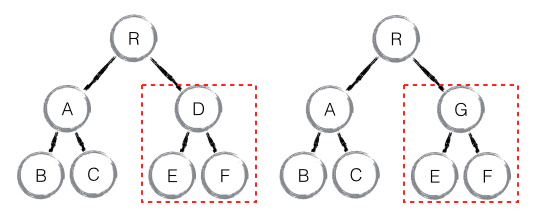
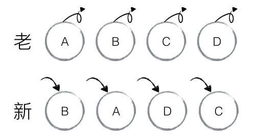
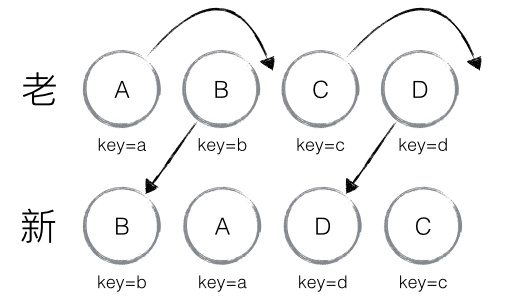
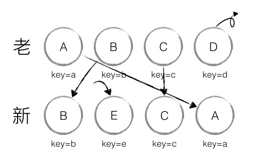
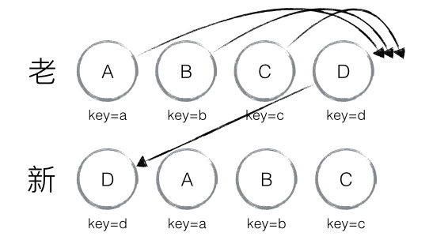

# Virtual DOM
所谓的 Virtual DOM 算法。包括几个步骤：

1. 用 JavaScript 对象结构表示 DOM 树的结构；然后用这个树构建一个真正的 DOM 树，插到文档中
2. 当状态变更的时候，重新构造一棵新的对象树。然后用新的树和旧的树进行比较，记录两棵树差异
3. 把2所记录的差异应用到步骤1所构建的真正的DOM树上，视图就更新了

所以Virtual DOM 本质上就是在 JS 和 DOM 之间做了一个缓存。可以类比 CPU 和硬盘，既然硬盘这么慢，我们就在它们之间加个缓存：既然 DOM 这么慢，我们就在它们 JS 和 DOM 之间加个缓存。CPU（JS）只操作内存（Virtual DOM），最后的时候再把变更写入硬盘（DOM）。

# Diff算法

diff作为Virtual DOM的加速器，其算法上的改进优化是React整个界面渲染的基础和性能保障。diff会计算出Virtual DOM中真正变化的部分，并只针对该部分进行原生DOM操作，而非渲染整个页面，这保证了每次操作更新后页面的高效渲染。

## 传统diff算法

传统diff算法通过循环递归对节点进行依次对比，算法复杂度达到了 O(n^3)。

## React diff

React通过制定大胆的策略，将O(n^3)复杂度降低到了O(n).

**diff策略：**

* 策略一： Web UI中的DOM节点跨层级移动操作特别少，可以忽略不计。
* 策略二： 相同类的两个组件会生成相似的树形结构，不同类的两个组件将会生成不同的树形结构。
* 策略三： 对于同一层的一组子节点，它们可以通过唯一ID进行区分。

基于以上策略，React对 **tree diff**, **component diff** 和 **element diff**进行了算法优化。


### tree diff

针对于策略一，React通过updateDepth对Virtual DOM树进行层级控制，只会对相同层级的DOM节点进行比较，即同一个父节点下的所有子节点。


```js
updateChildren: function(nextNestedChildrenElements, transaction, context) {
  updateDepth++;
  var errorThrown = true;
  try {
    this._updateChildren(nextNestedChildrenElements, transaction, context);
    errorThrown = false;
  } finally {
    updateDepth--;
    if (!updateDepth) {
      if (errorThrown) {
        clearQueue();
      } else {
        processQueue();
      }
    }
  }
}
```

### component diff

针对于策略二，对于组件采取的策略也是非常简洁、高效的。

* 如果是同一类型的组件，按照原策略继续比较。
* 如果不是，直接判断该组件为dirty component, 从而替换整个组件下的所有子节点。
* 对于同一类型的组件，有可能其 Virtual DOM 没有任何变化，React允许用户通过`shouldComponentUpdate()`来判断组件是否需要进行diff算法。



如上图所示，当组件D变成组件G时，即使这两个组件结构十分相似，但是一旦React判断D和G是不同类型的组件，就不会比较二者的结构，而是直接删除组件D，重新创建组件G及其子节点。

### element diff

当节点处于同一层级时，diff提供了三种节点操作，分别为**INSERT_MARKUP**（插入）、**MOVE_EXISTING**（移动）和 **REMOVE_NODE**（删除）。

* **INSERT_MARKUP**，新的 component 类型不在老集合里， 即是全新的节点，需要对新节点执行插入操作。
* **MOVE_EXISTING**，在老集合有新 component 类型，且 element 是可更新的类型，generateComponentChildren 已调用 receiveComponent，这种情况下 prevChild=nextChild，就需要做移动操作，可以复用以前的 DOM 节点。
* **REMOVE_NODE**，老 component 类型，在新集合里也有，但对应的 element 不同则不能直接复用和更新，需要执行删除操作，或者老 component 不在新集合里的，也需要执行删除操作。

**常规的diff操作流程：**



老集合中包含节点：A、B、C、D，更新后的新集合中包含节点：B、A、D、C，此时新老集合进行 diff 差异化对比，发现 B != A，则创建并插入 B 至新集合，删除老集合 A；以此类推，创建并插入 A、D 和 C，删除 B、C 和 D。


**React diff操作流程:**

React 发现这类操作繁琐冗余，因为这些都是相同的节点，但由于位置发生变化，导致需要进行繁杂低效的删除、创建操作，其实只要对这些节点进行位置移动即可。

针对这一现象，React 提出优化策略：允许开发者对同一层级的同组子节点，添加唯一 key 进行区分。



在element diff算法中， React使用了两个索引来进行判断。

* nextIndex: 对nextChildren的每个child遍历时的索引
* lastIndex: 访问过的节点在prevChildren中最大（最右）的索引

diff算法对新集合的节点进行循环遍历，`for (name in nextChildren)`，通过唯一 key 可以判断新老集合中是否存在相同的节点【在O(1)的时间内】，`if (prevChild === nextChild)`，如果存在相同节点，则进行移动操作，但在移动前需要将当前节点在老集合中的位置与 lastIndex 进行比较，`if (prevChild._mountIndex < lastIndex)`，则进行节点移动操作，否则不执行该操作。

**diff算法在这里使用了一种顺序优化的手段，`prevChild._mountIndex`表示该节点在旧集合中的位置。 如果`(prevChild._mountIndex > lastIndex)`，则表明当前访问的节点在旧集合中的位置就要比新集合中前面的节点位置靠后，该节点不会影响到其他节点的位置，因此不用添加到差异队列中去。**

看不明白？ 没关系，下面我们来以上图为例，演示一下diff差异化对比的过程。

1. 从新集合中取出B，同时在旧集合中发现相同节点B，接着判断是否进行移动操作。 B在旧集合中的位置`B._mountIndex = 1`, 此时的 `lastIndex = 0`, 不满足 `child._mountIndex < lastIndex `的条件，因此不对 B 进行移动操作；更新 `lastIndex = Math.max(prevChild._mountIndex, lastIndex)`，其中 `prevChild._mountIndex` 表示 B 在老集合中的位置，则 `lastIndex ＝ 1`. 并将 B 的位置更新为新集合中的位置 `prevChild._mountIndex = nextIndex`，此时新集合中 `B._mountIndex = 0`，`nextIndex++` 进入下一个节点的判断。
2. 从新集合中取出A，同时在旧集合中发现相同节点A，接着判断是否进行移动操作。A 在旧集合中的位置 `A._mountIndex = 0`，此时 `lastIndex = 1`，满足 `child._mountIndex < lastIndex`的条件.因此对 A 进行移动操作`enqueueMove(this, child._mountIndex, toIndex)`，其中 `toIndex` 其实就是 `nextIndex`，表示 A 需要移动到的位置；更新 `lastIndex = Math.max(prevChild._mountIndex, lastIndex)`，则 `lastIndex ＝ 1`，并将 A 的位置更新为新集合中的位置 `prevChild._mountIndex = nextIndex`，此时新集合中 `A._mountIndex = 1`，`nextIndex++` 进入下一个节点的判断。
3. C, D节点同理。



上图显示的环节多了插入节点的操作，插入节点操作非常简单，直接将新节点的信息入队，然后`nextIndex++`就好了。

**特殊情况**：还有一种特殊情况是如果新集合和旧集合有两个key相同，但是节点类型不同的元素，这时要将`lastIndex = Math.max(prevChild._mountIndex, lastIndex);`，然后将新节点入队即可。这样在`unmount`之前更新`lastIndex`可以减少一些不必要的移动操作。

**注意**：当完成新集合中所有节点 diff 时，最后还需要对老集合进行循环遍历，判断是否存在新集合中没有但老集合中仍存在的节点，发现存在这样的节点，就删除节点 ，到此 diff 全部完成。

### 不足



如上图所示，若新集合的节点更新为：D、A、B、C，与老集合对比只有 D 节点移动，而 A、B、C 仍然保持原有的顺序，理论上 diff 应该只需对 D 执行移动操作，然而由于 D 在老集合的位置是最大的，导致其他节点的  `_mountIndex < lastIndex`，造成 D 没有执行移动操作，而是 A、B、C 全部移动到 D 节点后面的现象。

>建议：在开发过程中，尽量减少类似将最后一个节点移动到列表首部的操作，当节点数量过大或更新操作过于频繁时，在一定程度上会影响 React 的渲染性能。


### 总结

* React 通过制定大胆的 diff 策略，将 O(n3) 复杂度的问题转换成 O(n) 复杂度的问题；

* React 通过**分层求异**的策略，对 tree diff 进行算法优化；
* React 通过**相同类生成相似树形结构，不同类生成不同树形结构**的策略，对 component diff 进行算法优化；
* React 通过**设置唯一 key**的策略，对 element diff 进行算法优化；
* 建议，在开发组件时，保持稳定的 DOM 结构会有助于性能的提升；
* 建议，在开发过程中，尽量减少类似将最后一个节点移动到列表首部的操作，当节点数量过大或更新操作过于频繁时，在一定程度上会影响 React 的渲染性能。


### `updateChildren`方法源码

```js

 /**
     * @param {?object} nextNestedChildrenElements Nested child element maps.
     * @param {ReactReconcileTransaction} transaction
     * @final
     * @protected
     */
    _updateChildren: function (nextNestedChildrenElements, transaction, context) {
      var prevChildren = this._renderedChildren;
      var removedNodes = {};
      var mountImages = [];
      var nextChildren = this._reconcilerUpdateChildren(prevChildren, nextNestedChildrenElements, mountImages, removedNodes, transaction, context);
      if (!nextChildren && !prevChildren) {
        return;
      }
      var updates = null;
      var name;
      // `nextIndex` will increment for each child in `nextChildren`, but
      // `lastIndex` will be the last index visited in `prevChildren`.
      var nextIndex = 0;
      var lastIndex = 0;
      // `nextMountIndex` will increment for each newly mounted child.
      var nextMountIndex = 0;
      var lastPlacedNode = null;
      for (name in nextChildren) {
        if (!nextChildren.hasOwnProperty(name)) {
          continue;
        }
        var prevChild = prevChildren && prevChildren[name];
        var nextChild = nextChildren[name];
        if (prevChild === nextChild) {
          updates = enqueue(updates, this.moveChild(prevChild, lastPlacedNode, nextIndex, lastIndex));
          lastIndex = Math.max(prevChild._mountIndex, lastIndex);
          prevChild._mountIndex = nextIndex;
        } else {
          if (prevChild) {
            // Update `lastIndex` before `_mountIndex` gets unset by unmounting.
            lastIndex = Math.max(prevChild._mountIndex, lastIndex);
            // The `removedNodes` loop below will actually remove the child.
          }
          // The child must be instantiated before it's mounted.
          updates = enqueue(updates, this._mountChildAtIndex(nextChild, mountImages[nextMountIndex], lastPlacedNode, nextIndex, transaction, context));
          nextMountIndex++;
        }
        nextIndex++;
        lastPlacedNode = ReactReconciler.getHostNode(nextChild);
      }
      // Remove children that are no longer present.
      for (name in removedNodes) {
        if (removedNodes.hasOwnProperty(name)) {
          updates = enqueue(updates, this._unmountChild(prevChildren[name], removedNodes[name]));
        }
      }
      if (updates) {
        processQueue(this, updates);
      }
      this._renderedChildren = nextChildren;

      if (process.env.NODE_ENV !== 'production') {
        setChildrenForInstrumentation.call(this, nextChildren);
      }
    },
```

### `moveChild`源码：

```js
  moveChild: function (child, afterNode, toIndex, lastIndex) {
      // If the index of `child` is less than `lastIndex`, then it needs to
      // be moved. Otherwise, we do not need to move it because a child will be
      // inserted or moved before `child`.
      if (child._mountIndex < lastIndex) {
        return makeMove(child, afterNode, toIndex);
      }
    },
```

### 五种节点操作（updateChildren只使用了三种）

`makeInsertMarkup`（插入节点操作）:

```js
/**
 * Make an update for markup to be rendered and inserted at a supplied index.
 *
 * @param {string} markup Markup that renders into an element.
 * @param {number} toIndex Destination index.
 * @private
 */
function makeInsertMarkup(markup, afterNode, toIndex) {
  // NOTE: Null values reduce hidden classes.
  return {
    type: 'INSERT_MARKUP',
    content: markup,
    fromIndex: null,
    fromNode: null,
    toIndex: toIndex,
    afterNode: afterNode
  };
}
```

`makeMove `(移动节点操作):

```js
/**
 * Make an update for moving an existing element to another index.
 *
 * @param {number} fromIndex Source index of the existing element.
 * @param {number} toIndex Destination index of the element.
 * @private
 */
function makeMove(child, afterNode, toIndex) {
  // NOTE: Null values reduce hidden classes.
  return {
    type: 'MOVE_EXISTING',
    content: null,
    fromIndex: child._mountIndex,
    fromNode: ReactReconciler.getHostNode(child),
    toIndex: toIndex,
    afterNode: afterNode
  };
}
```

`makeRemove`(删除节点操作)：

```js
/**
 * Make an update for removing an element at an index.
 *
 * @param {number} fromIndex Index of the element to remove.
 * @private
 */
function makeRemove(child, node) {
  // NOTE: Null values reduce hidden classes.
  return {
    type: 'REMOVE_NODE',
    content: null,
    fromIndex: child._mountIndex,
    fromNode: node,
    toIndex: null,
    afterNode: null
  };
}
```

`makeSetMarkup`(替换节点)：

```js
/**
 * Make an update for setting the markup of a node.
 *
 * @param {string} markup Markup that renders into an element.
 * @private
 */
function makeSetMarkup(markup) {
  // NOTE: Null values reduce hidden classes.
  return {
    type: 'SET_MARKUP',
    content: markup,
    fromIndex: null,
    fromNode: null,
    toIndex: null,
    afterNode: null
  };
}
```

`makeTextContent`（更新节点内容）：

```js
/**
 * Make an update for setting the text content.
 *
 * @param {string} textContent Text content to set.
 * @private
 */
function makeTextContent(textContent) {
  // NOTE: Null values reduce hidden classes.
  return {
    type: 'TEXT_CONTENT',
    content: textContent,
    fromIndex: null,
    fromNode: null,
    toIndex: null,
    afterNode: null
  };
}
```


