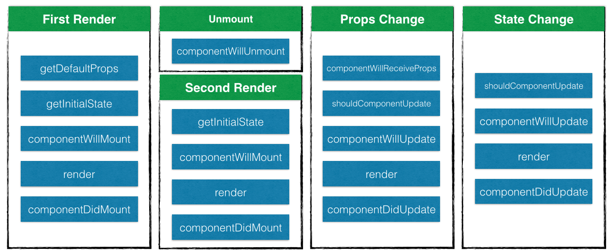
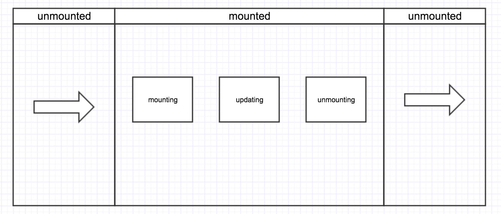
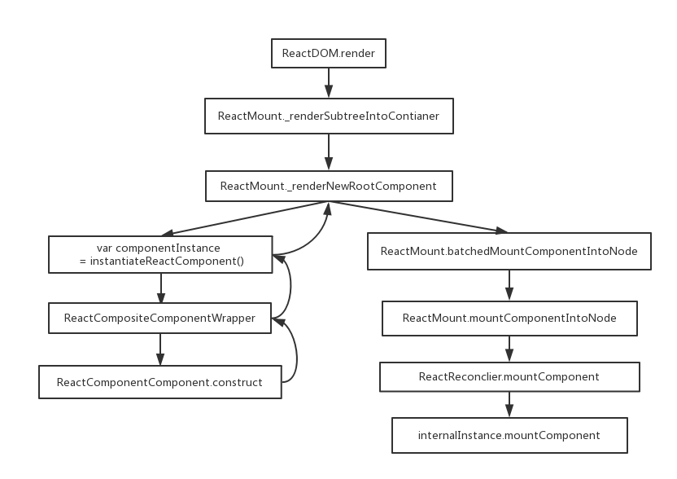

## React的 **props** 和 **state**
react的主要思想是**通过构建可复用组件来构建用户界面**。react的组件其实就是[有限状态机](https://zh.wikipedia.org/zh-cn/%E6%9C%89%E9%99%90%E7%8A%B6%E6%80%81%E6%9C%BA)，通过状态渲染对应的界面。react渲染界面的方式有三种：

* ReactDOM.render.
* props.
* state.

## React生命周期
React的生命周期规定了组件的状态和方法需要在哪个阶段改变和执行。通过它，我们就可以实现组件的状态机控制，从而达到“生命周期 -> 状态 -> 组件"的和谐画面。

在自定义React组件时，我们会根据在组件生命周期的不同阶段实现不同的逻辑。为了查看组建生命周期的执行顺序，我写了一个[demo](https://plnkr.co/edit/ZzoJiAQFz0o5ssFLyZqU?p=preview)。



* 当首次装载组件时，按顺序执行 getDefaultProps、getInitialState、componentWillMount、render 和 componentDidMount；

* 当卸载组件时，执行 componentWillUnmount；

* 当重新装载组件时，此时按顺序执行 getInitialState、componentWillMount、render 和 componentDidMount，但并不执行 getDefaultProps；

* 当再次渲染组件时，组件接受到更新状态。
    * 如果是Props change，此时按顺序执行 componentWillReceiveProps、shouldComponentUpdate、componentWillUpdate、render 和 componentDidUpdate。

    * 如果是State change，此时按顺序执行shouldComponentUpdate、componentWillUpdate、render 和 componentDidUpdate。

### 疑问
* Q1: 为什么getDefaultProps只执行了一次,而每个实例都共享defaultProps的值?
* Q2: 为什么会按照上述顺序执行生命周期？
* Q3: 为什么多次渲染时，react会执行生命周期的不同阶段？


## 详解React生命周期
React将生命周期分为三个阶段：

* Mounting:  React Components被render解析生成对应的DOM节点并被插入浏览器的DOM结构的过程.
* Updating: 当state发生变化时，一个mounted的React Components被重新render的过程.
* Unmounting: 一个mounted的React Components对应的DOM节点被从DOM结构中移除的过程.



这三种阶段分别对应了`ReactCompositeComponent.js`文件中的三种方法:

* mountComponent
* updateComponent
* unmountComponent

每个方法都提供了几种处理方法。其中带will前缀方法在进入状态前被调用，带did前缀的方法在进入状态之后调用。
### Q1:为什么getDefaultProps只执行了一次,而每个实例都共享defaultProps的值?
我们先来看一段使用ES5语法的<Welcome/>组件写法：

```js
var Welcome = React.createClass({
  getInitialState: function() {},
  getDefaultProps: function() {bar: 2},
  
  render: function(){
    return (
      <div>
        this.props.bar: {this.props.bar}
      </div>
    );
  }
});

ReactDOM.render(
  <Welcome/>,
  document.getElementById('main')
);
```
#### createClass创建自定义组件
createClass 创建自定义组件的入口方法，负责管理生命周期中的 getDefaultProps。getDefaultProps 方法只执行一次，这样所有实例初始化的 props 将会被共享。

<Welcome/>组件代码中，我们先使用`React.createClass()`方法来创建React组件,那么就来看看这个方法的内部实现:

```js
//由于源码内容大，只展示重要内容
 createClass: function(spec) {
    var Constructor = identity(function(props, context, updater) {

      // 自动绑定
      if (this.__reactAutoBindPairs.length) {
        bindAutoBindMethods(this);
      }

      this.props = props;
      this.context = context;
      this.refs = emptyObject;
      this.updater = updater || ReactNoopUpdateQueue;

      this.state = null;

      // ReactClass没有构造函数，通过getInitialState 和 componentWillMount来代替
      var initialState = this.getInitialState ? this.getInitialState() : null;
      this.state = initialState;
    };

    //原型继承父类
    Constructor.prototype = new ReactClassComponent();
    Constructor.prototype.constructor = Constructor;
    Constructor.prototype.__reactAutoBindPairs = [];

    //合并mixin
    mixSpecIntoComponent(Constructor, spec);

    // 所有mixin合并后初始化defalutProps(在整个生命周期中, getDefaultProps只执行一次)
    if (Constructor.getDefaultProps) {
      Constructor.defaultProps = Constructor.getDefaultProps();
    }

    // 通过在原型上设置这些来减少花费在查找的时间。
    for (var methodName in ReactClassInterface) {
      if (!Constructor.prototype[methodName]) {
        Constructor.prototype[methodName] = null;
      }
    }

    return Constructor;
  },
```

`React.createClass()`方法会返回一个名为`Constructor`方法，`Constructor`方法会将 **用户重写的生命周期方法** 与 **未重写的默认生命周期方法** mix进原型中。然后来执行`Constructor.getDefaultProps()`方法并且把结果放入`Constructor.defaultProps`变量中。最后执行`this.getInitialState()`方法获得初始的state。

这解释了初始化时`getDefaultProps()`方法和`getInitialState()`方法的顺序。


#### ReactDOM.render渲染组件

```js
ReactDOM.render(
  <Welcome/>,
  document.getElementById('main')
);
```

ReactDOM.render方法中的<Welcome/>组件使用了JSX语法编写。JSX元素只是调用`React.createElement(component, props, ...children)`的语法糖。它的奥秘是什么？接下来让我们来看看`React.createElement()`方法的内部实现：

```js
//createElement只是做了简单的参数修正，返回了一个ReactElement实例对象。
ReactElement.createElement = function (type, config, children) {

  //初始化参数
  var propName;
  var props = {};
  var key = null;
  var ref = null;
  var self = null;
  var source = null;

  //如果存在config，则提取里面的内容，config就是props
  if (config != null) {
    if (hasValidRef(config)) {
      ref = config.ref;
    }
    if (hasValidKey(config)) {
      key = '' + config.key;
    }
    self = config.__self === undefined ? null : config.__self;
    source = config.__source === undefined ? null : config.__source;
    
    // 复制config里的内容到props（例如id和className等）
    for (propName in config) {
      if (hasOwnProperty.call(config, propName) && !RESERVED_PROPS.hasOwnProperty(propName)) {
        props[propName] = config[propName];
      }
    }
  }

  //处理children,全部挂载到props的children属性上。如果只有一个参数，直接复制给children,   
  //否则做合并处理。
  var childrenLength = arguments.length - 2;
  if (childrenLength === 1) {
    props.children = children;
  } else if (childrenLength > 1) {
    var childArray = Array(childrenLength);
    for (var i = 0; i < childrenLength; i++) {
      childArray[i] = arguments[i + 2];
    }
    props.children = childArray;
  }

  // 重点！这里是将type类型的组件初始化是的defaultProps赋值给当前实例的defaultProps
  if (type && type.defaultProps) {
    var defaultProps = type.defaultProps;
    for (propName in defaultProps) {
      if (props[propName] === undefined) {
        props[propName] = defaultProps[propName];
      }
    }
  }
  
  //返回一个ReactElement对象
  return ReactElement(type, key, ref, self, source, ReactCurrentOwner.current, props);
};
```

从`React.createElement()`方法的实现中，我们可以发现每次新生成一个type类型组件的实例，就将type组件类的defaultProps赋值给该实例的defaultProps，这实现了各个实例共享defaultProps的功能，但是type组件类只会初始化一次，即`getDefaultProps()`方法只会在声明组件时被调用。

同时应该注意到在向当前实例赋值`defaultProps`时，会判断`props`数组中是否已经包含`defaultProps`中的属性，且会跳过已经存在的属性。

### Q2: 为什么会按照上述顺序执行生命周期？
为了解决这个问题，我从`ReactDOM.render()`方法入手研究React渲染过程，打算找出它是如何管理React组件实例生命周期过程。结果被绕晕了好多次。。。


* `_renderSubtreeIntoContainer`: 为React组件元素分配RootID,添加Render方法。
* `ReactCompositeComponent.construct`:将React组件元素的所有参数初始化后返回。
* 在instantiateReactComoponent中`ReactCompositeComponentWrapper`继承了`ReactCompositeComponent`，所以`componentInstance`具有了`ReactCompositeComponent`中的生命周期方法，在`ReactReconclier.mountComponent`中调用了`mountComponent`方法来执行mouting阶段生命周期方法。


### 阶段一： MOUNTING
mountComponent 负责管理生命周期中的 getInitialState、componentWillMount、render 和 componentDidMount。（我目前看的V15.4.1版本的React源码中mountComoponent没有`getInitialState`方法，可能是ES6中使用`this.state={}`来代替`getInitialState`方法的缘故)。

由于 getDefaultProps 是通过 Constructor 进行管理，因此也是整个生命周期中最先开始执行，而 mountComponent 无法调用到 getDefaultProps。这就解释了为何 getDefaultProps 只执行1次的原因。

#### mounting 过程:
* 首先通过 mountComponent 装载组件，初始化序号，标记等参数，判断是否为无状态组件，并进行对应的组件初始化工作，比如初始化props, context参数。

* 若存在 componentWillMount，则执行；如果此时在 componentWillMount 中调用 setState，是不会触发 reRender，而是进行 state 合并,且`inst.state = this._processPendingState(inst.props, inst.context)`是在componentWillMount之后执行的，因此componentWillMount中的this.state不是最新的，在render中才可以获取更新后的this.state.
    * 其实，mountComponent 本质上是通过 递归渲染 内容的，由于递归的特性，父组件的 componentWillMount 一定在其子组件的 componentWillMount 之前调用，而父组件的 componentDidMount 肯定在其子组件的 componentDidMount 之后调用。

* 当渲染完成之后，若存在 componentDidMount 则触发。这就解释了 componentWillMount - render - componentDidMount 三者之间的执行顺序。


```js
//React V15.4.1源码
//当组件挂载时，会分配一个递增编号，表示执行ReactUpdates时更新组件的顺序
var nextMountID = 1;
//初始化组件，渲染标记，注册事件监听器
mountComponent: function (transaction, hostParent, hostContainerInfo, context) {
	//当前元素对应的上下文
    var _this = this;

    this._context = context;
    this._mountOrder = nextMountID++;
    this._hostParent = hostParent;
    this._hostContainerInfo = hostContainerInfo;

    var publicProps = this._currentElement.props;
    var publicContext = this._processContext(context);

    var Component = this._currentElement.type;

    var updateQueue = transaction.getUpdateQueue();

    // 初始化公共类
    var doConstruct = shouldConstruct(Component);
    var inst = this._constructComponent(doConstruct, publicProps, publicContext, updateQueue);
    var renderedElement;

    // 支持stateless组建
    if (!doConstruct && (inst == null || inst.render == null)) {
      renderedElement = inst;
      warnIfInvalidElement(Component, renderedElement);
      inst = new StatelessComponent(Component);
      this._compositeType = CompositeTypes.StatelessFunctional;
    } else {
      if (isPureComponent(Component)) {
        this._compositeType = CompositeTypes.PureClass;
      } else {
        this._compositeType = CompositeTypes.ImpureClass;
      }
    }

    //这些初始化参数本应该在构造函数中设置，在此设置时为了便于进行简单的类抽象
    inst.props = publicProps;
    inst.context = publicContext;
    inst.refs = emptyObject;
    inst.updater = updateQueue;

    this._instance = inst;

    //将实例存储为一个引用
    ReactInstanceMap.set(inst, this);

    //初始化state，奇怪的是这里没有调用getInitialState方法
    var initialState = inst.state;
    if (initialState === undefined) {
      inst.state = initialState = null;
    }
    
    //初始化更新队列
    this._pendingStateQueue = null;
    this._pendingReplaceState = false;
    this._pendingForceUpdate = false;

    var markup;
    //如果挂载时出现错误
    if (inst.unstable_handleError) {
      markup = this.performInitialMountWithErrorHandling(renderedElement, hostParent, hostContainerInfo, transaction, context);
    } else {
      //执行初始化挂载，这里会执行ComponentWillMount和Render函数，并且递归的render该
      //组件的children.
      // - componentWillMount
      // - render
      //  - [children's constructors]
      //  - [children's componentWillMount and render]
      //  - [children's componentDidMount]
 
      markup = this.performInitialMount(renderedElement, hostParent, hostContainerInfo, transaction, context);
    }
    
    //如果存在componentDidMount,则调用
    if (inst.componentDidMount) {
      if (process.env.NODE_ENV !== 'production') {
        transaction.getReactMountReady().enqueue(function () {
          measureLifeCyclePerf(function () {
            return inst.componentDidMount();
          }, _this._debugID, 'componentDidMount');
        });
      } else {
        transaction.getReactMountReady().enqueue(inst.componentDidMount, inst);
      }
    }

    return markup;
  },
  
  
  
  performInitialMount: function (renderedElement, hostParent, hostContainerInfo, transaction, context) {
    var inst = this._instance;

    var debugID = 0;
    if (process.env.NODE_ENV !== 'production') {
      debugID = this._debugID;
    }
    //如果存在componentWillMount，则调用
    if (inst.componentWillMount) {
          inst.componentWillMount();
   
      //componentWillMount调用setState时，不会触发re-render二十自动提前合并
      if (this._pendingStateQueue) {
        inst.state = this._processPendingState(inst.props, inst.context);
      }
    }

    // 如果不是无状态组件，即可开始渲染
    if (renderedElement === undefined) {
      renderedElement = this._renderValidatedComponent();
    }
    
    //递归渲染child
    var nodeType = ReactNodeTypes.getType(renderedElement);
    this._renderedNodeType = nodeType;
    var child = this._instantiateReactComponent(renderedElement, nodeType !== ReactNodeTypes.EMPTY /* shouldHaveDebugID */
    );
    this._renderedComponent = child;

    var markup = ReactReconciler.mountComponent(child, transaction, hostParent, hostContainerInfo, this._processChildContext(context), debugID);

    return markup;
  },
```


